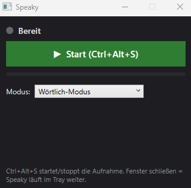

# Speaky

Kleine Windows-11-Hintergrund-App: Hotkey drücken → sprechen → loslassen → Text landet im gerade aktiven Eingabefeld. Deutsch. Lokal. Kein Cloud-Service nötig.

<p align="center">
  
</p>

## Was das MVP kann

- **System-Tray-App** mit kleiner WPF-GUI (Start/Stop, Status, Modus-Auswahl, VU-Meter)
- **Globaler Hotkey** `Ctrl+Alt+S` — startet/stoppt die Aufnahme überall in Windows
- **Mikrofon-Aufnahme** in 16 kHz Mono via NAudio
- **Lokale Transkription** via Whisper.net (deutsches Sprachmodell, offline)
- **Automatisches Einfügen** in das fokussierte Eingabefeld via Clipboard + Ctrl+V (Win32 `SendInput`)
- **4 Modi** mit unterschiedlichem Post-Processing:
  1. **Blitz** – Text 1:1 wie gesprochen
  2. **Ausschreib** – Satzzeichen/Groß-Klein aufgeräumt
  3. **Diplomatie** – wütendes Diktat → höfliche Business-Sprache via lokalem LLM (Ollama, optional)
  4. **Emoji** – Text + 1–5 zufällige Emojis (per Slider)

## Voraussetzungen

- **Windows 10 / 11 (x64)**. Das Projekt zielt explizit auf `net8.0-windows` mit WPF + WinForms und läuft nicht auf Linux/macOS.
- **.NET 8 SDK (x64)**. Download: https://dotnet.microsoft.com/download/dotnet/8.0 (wähle "SDK x64"). Prüfen im Terminal: `dotnet --version` sollte mit `8.0.` beginnen.
- **Visual Studio wird NICHT benötigt** – das reine `dotnet` CLI reicht für Build und Run.
- **Git** (optional, nur für `git clone`; alternativ kannst du das Repo auch als ZIP von GitHub laden).
- Ca. **500 MB freier Plattenplatz** für das Whisper-Modell plus ~200 MB für Build-Artefakte.
- Ein **Mikrofon** plus die Windows-Erlaubnis, dass Desktop-Apps darauf zugreifen dürfen (siehe Schritt 4).

## Setup

### 0. Repository klonen

```bash
git clone https://github.com/ElwinEhlers/speaky.git
cd speaky
```

### 1. Abhängigkeiten wiederherstellen

```bash
dotnet restore
```

### 2. Whisper-Modell herunterladen

Die App erwartet ein GGML-Whisper-Modell unter `whisper-models/ggml-small.bin` neben der EXE.

**Empfohlen für Deutsch:** `ggml-small.bin` (~488 MB, deutlich besser als base, immer noch schnell).
**Noch besser aber langsamer:** `ggml-medium.bin` (~1.5 GB).

Download:

```
https://huggingface.co/ggerganov/whisper.cpp/resolve/main/ggml-small.bin
```

Ablegen unter:

```
<Projektordner>/whisper-models/ggml-small.bin
```

Die Datei wird beim Build automatisch in den Output-Ordner kopiert (siehe `Speaky.csproj`).

Wenn du ein anderes Modell verwenden willst, passe den Pfad in `App.xaml.cs` an (`modelPath`).

### 3. Bauen und starten

Aus dem Projekt-Root:

```bash
dotnet build Speaky.csproj -c Release
```

Die fertige EXE liegt danach unter:

```
bin\Release\net8.0-windows\Speaky.exe
```

Starten kannst du sie auf drei Wegen:

- **Doppelklick** auf `Speaky.exe` im Explorer
- **Aus dem Terminal:** `bin\Release\net8.0-windows\Speaky.exe`
- **Über dotnet run:** `dotnet run --project Speaky.csproj -c Release`

Der **erste Start** dauert oft 10–30 s länger als spätere, weil Windows Defender die Native-DLLs von Whisper.net.Runtime einmalig scannt und Whisper das Modell zum ersten Mal in den RAM lädt. Danach ist jeder weitere Start flott.

### 4. Mikrofon-Berechtigung

Beim ersten Start muss Windows die Mikrofon-Nutzung für Desktop-Apps erlauben:

**Einstellungen → Datenschutz & Sicherheit → Mikrofon → "Desktop-Apps Zugriff erlauben" = EIN**

Falls das Mikrofon blockiert ist, zeigt Speaky eine entsprechende Meldung.

### 5. (Optional) Ollama für den Diplomatie-Modus

Der **Diplomatie-Modus** formuliert wütendes Diktat in ruhige, sachliche Business-Sprache um. Dafür braucht Speaky ein lokales LLM via [Ollama](https://ollama.com). Wer Diplomatie nicht benutzt, kann diesen Schritt komplett überspringen – Blitz/Ausschreib/Emoji funktionieren auch ohne Ollama und starten ihn nie.

1. Ollama für Windows installieren: https://ollama.com/download/windows
2. Mindestens eines der drei unterstützten Modelle ziehen:

    ```bash
    ollama pull qwen3:8b       # ~5 GB, schnellstes Diplomatie-Modell
    ollama pull gemma4:e4b     # ~10 GB, mittlere Qualität
    ollama pull gemma4:26b     # ~17 GB, beste Qualität
    ```

3. **Autostart deaktivieren (empfohlen):** Ollama installiert sich unter Windows standardmäßig als Autostart-Dienst mit Tray-Icon. Wenn du Ollama nur für Speaky brauchst, deaktiviere das unter **Einstellungen → Apps → Autostart → Ollama = Aus**. Speaky startet Ollama dann bei Bedarf selbst (erst beim ersten Diplomatie-Toggle) und **killt ihn wieder beim eigenen Shutdown** – so läuft Ollama nicht dauerhaft im Hintergrund.

    Wenn du Ollama auch für andere Tools (LM Studio, OpenWebUI, CLI) parallel nutzt, lass den Autostart an. Speaky erkennt einen bereits laufenden Ollama-Server und fasst ihn nicht an.

4. In der Speaky-GUI den Modus **Diplomatie** wählen. Im erscheinenden Dropdown das gewünschte Modell auswählen. Der erste Diplomatie-Toggle dauert ein paar Sekunden länger, weil Ollama den Server startet und das Modell in den RAM lädt.

Wenn Ollama nicht installiert oder nicht erreichbar ist, zeigt Speaky im Diplomatie-Modus "Ollama nicht erreichbar – Rohtext eingefügt" an und fügt den normalen (aufgeräumten) Transkripttext ein. Die App bleibt also auch ohne LLM benutzbar.

## Bedienung

1. Cursor in das Zieleingabefeld setzen (Chat, Texteditor, Suche, …)
2. `Ctrl+Alt+S` drücken **oder** Start-Button klicken
3. Sprechen
4. `Ctrl+Alt+S` nochmal drücken **oder** Stop-Button klicken
5. Warten (1–3 s beim ersten Mal, <1 s danach) — Text wird eingefügt

## Troubleshooting

- **"Modell fehlt – siehe README"** im Statusfeld: Die Datei `whisper-models/ggml-small.bin` liegt nicht neben der EXE. Download nochmal prüfen (Schritt 2 oben) und sicherstellen, dass die Datei **nach dem Build** im Ordner `bin\Release\net8.0-windows\whisper-models\` auftaucht. Die `.csproj` kopiert sie automatisch, aber nur wenn sie im Quell-Ordner liegt.
- **"Mikrofon-Fehler"** beim Start der Aufnahme: Entweder existiert kein aktives Standard-Aufnahmegerät, oder Desktop-Apps haben keinen Mikrofon-Zugriff (siehe Schritt 4). Prüfen in **Einstellungen → System → Sound → Eingabe**, dass ein Gerät ausgewählt ist.
- **Hotkey `Ctrl+Alt+S` macht nichts**: Eine andere App hat ihn schon belegt (häufig: Snipping Tool, Steam-Overlay, OBS). Der Start-Button in der GUI funktioniert weiterhin; die eigentliche Lösung ist, die andere App zu stoppen oder Speaky später auf einen freien Hotkey umzukonfigurieren.
- **Aufnahme läuft, aber es wird kein Text eingefügt**: Wenn das Zielfenster als Administrator läuft und Speaky nicht, blockt UIPI das simulierte `Ctrl+V`. Speaky ebenfalls als Administrator starten. Remote-Desktop-/Citrix-Sessions haben ähnliche Symptome, je nach Clipboard-Durchreiche der Session.
- **Erster Transcribe dauert ~30 s**: Normal. Windows Defender scannt beim ersten Start die native `whisper.dll`, und Whisper lädt das Modell erstmalig in den RAM. Ab dem zweiten Mal <1 s.
- **Diagnose-Log**: Bei merkwürdigen Ausgaben (Halluzinationen, leerer Text, kaputte Zeichen) liegt neben der EXE eine `whisper-debug.log`. Darin steht segmentweise, was Whisper wirklich zurückgegeben hat — damit lässt sich eingrenzen, ob der Bug in Whisper, im Mode-Processing oder in der Text-Insertion steckt.

## Architektur (Kurzfassung)

```
App.xaml.cs                 ← Composition Root, verdrahtet alle Services
├── MainWindow              ← kompakte GUI
├── TrayIconService         ← System-Tray
├── HotkeyService           ← Win32 RegisterHotKey
├── AudioRecorder           ← NAudio WaveInEvent
├── TranscriptionService    ← Whisper.net
├── TextInsertion           ← Win32 SendInput (Clipboard + Ctrl+V)
├── ModeManager             ← Post-Processing pro Modus (async)
├── OllamaLifecycle         ← startet/killt Ollama on demand (nur Diplomatie)
├── LlmService              ← OpenAI-kompatible Chat-Completions → Ollama
└── Models/
    ├── RecordingState      ← Shared State GUI ↔ Hotkey ↔ LLM-Modell
    └── RecordingMode       ← Blitz / Ausschreib / Diplomatie / Emoji
```

GUI-Button und Hotkey ändern denselben `RecordingState`. Dadurch sind Button-Label, Tray-Icon und Hotkey-Verhalten immer synchron — egal womit gestartet wurde.

## Der `WhisperTest/`-Ordner

Im Repo liegt ein kleines **eigenständiges Console-Programm** unter `WhisperTest/` (`Program.cs` + `WhisperTest.csproj`). Es ist **nicht Teil des Speaky-Builds** — die Haupt-`Speaky.csproj` schließt den Ordner explizit aus:

```xml
<Compile Remove="WhisperTest\**" />
<None Remove="WhisperTest\**" />
<EmbeddedResource Remove="WhisperTest\**" />
<Page Remove="WhisperTest\**" />
```

Zweck: Minimales, WPF-freies Whisper.net-Setup, das denselben Modellpfad und dieselbe WAV-Datei verwendet wie Speaky. Genau dieses Programm hat beim MVP-Build bewiesen, dass Whisper sauber transkribiert — während Speaky in derselben Version halluzinierte. Dadurch ließ sich der Bug zweifelsfrei auf die WPF-SynchronizationContext-Interaktion einkreisen (siehe "Hart erkaufte Lessons Learned" #1).

Falls Whisper in Speaky nochmal seltsame Dinge tut, ist das der erste Test, den man laufen lässt:

```bash
dotnet run --project WhisperTest/WhisperTest.csproj -c Release
```

Wenn **dort** die Ausgabe sauber ist, aber in Speaky kaputt, liegt der Fehler garantiert nicht in Whisper oder im Modell, sondern in der Integration (Threading, Dispatcher, Mode-Processing, Text-Insertion).

## Bekannte Grenzen / Edge Cases

- **Clipboard-Einfügen verändert kurz die Zwischenablage**: Speaky sichert den bisherigen Inhalt und stellt ihn nach ~150 ms wieder her, d.h. in dem kurzen Fenster kann ein anderer Prozess, der genau dann aus der Clipboard liest, unseren Text sehen. In der Praxis unkritisch.
- **Clipboard-Einfügen setzt voraus**, dass das Zielfeld `Ctrl+V` unterstützt. Klassische Win32-/WPF-/Electron-/Browser-Eingabefelder: ja. Manche Spiele/Custom-Controls: nein.
- **Erstes Transkript dauert länger**, weil Whisper das Modell erst in den RAM lädt. Danach ist es schnell.
- **Hotkey-Konflikt**: Wenn eine andere App bereits `Ctrl+Alt+S` belegt, schlägt das `RegisterHotKey` fehl. GUI-Button bleibt nutzbar. Späterer Ausbau: Hotkey in Settings änderbar machen.
- **UAC-erhöhte Prozesse**: Wenn Speaky nicht-erhöht läuft, blockt UIPI das `SendInput` von Ctrl+V in erhöhte Fenster. Workaround: Speaky als Administrator starten.
- **Remote Desktop / Citrix**: Clipboard-Paste kommt je nach Konfiguration nicht durch.
- **Zu kurze Aufnahmen (< 0.5 s)** liefern oft leeren Text — Whisper braucht etwas Kontext.

## Hart erkaufte Lessons Learned

Damit das nicht noch einmal stundenlang debuggt werden muss, wenn jemand das Ding neu aufsetzt:

1. **Whisper.net + WPF = `WhisperFactory` nicht cachen + in `Task.Run` wrappen.**
   Frühere Version cachte die Factory als Feld (`_factory ??= ...`) und lief die `ProcessAsync`-Schleife direkt auf dem UI-Thread-SynchronizationContext. Resultat: Halluzinationen wie `"Hallo, ]]]]]]]]]]"` obwohl der exakt gleiche Code+Modell+WAV in einer Console-App sauber transkribiert. Behoben durch: frische Factory pro Aufruf + `Task.Run(...)` drum herum. Siehe `Services/TranscriptionService.cs`.

2. **Text-Einfügen darf NICHT zeichenweise per `SendInput` mit `KEYEVENTF_UNICODE` gemacht werden.**
   Die MVP-Variante hat jedes Zeichen einzeln getippt. Resultat: `"Hallo ppeake,...……………."` obwohl Whisper sauber `"Hallo Speake, dies ist ein Test."` geliefert hat. Ursachen: Modifier-Leaks vom gerade losgelassenen `Ctrl+Alt+S`, Win11-Notepad-Autocorrect wandelt `...` in `…`, Target-App verschluckt Zeichen bei 60+ Events in einem Rutsch. Behoben durch: Clipboard + Ctrl+V (mit Backup/Restore der Original-Clipboard). Siehe `Services/TextInsertion.cs`.

3. **Modifier-Drain vor dem `Ctrl+V`.**
   Bevor Speaky `Ctrl+V` schickt, wartet es per `GetAsyncKeyState` bis zu 400 ms, bis physisch kein `Ctrl`/`Alt`/`Shift`/`Win` mehr gedrückt ist. Sonst mischt sich das gerade losgelassene `Ctrl+Alt+S` mit unserem eigenen `Ctrl+V` zu einer unerwünschten Tastenkombination.

4. **Diagnose-Log.** `TranscriptionService` schreibt bei jedem Aufruf `whisper-debug.log` neben der `.exe`, inklusive jedem Whisper-Segment mit Zeitstempel. Unbezahlbar, um zu sehen, ob ein Bug in Whisper, im Mode-Processing oder in der Text-Insertion steckt. Ist in der .gitignore.

## Nächste Ausbau-Ideen nach dem MVP

1. **Alternative Transkription** (Azure Speech, OpenAI Whisper API) — `TranscriptionService` hinter ein Interface legen.
2. **Konfigurierbarer Hotkey** in einem Settings-Fenster.
3. **Autostart mit Windows** (Registry-Eintrag oder Scheduled Task).
4. **Sprach-Feedback** (kurzer Ton beim Start/Stop) statt nur visuell.
5. **Transcript-Historie** (letzte 10 Einfügungen, Undo).
6. **Custom Wörterbuch** für Namen/Fachbegriffe, die Whisper falsch versteht (z.B. "Speaky" wird oft als "Spiky"/"Speakey"/"Speake" transkribiert).
7. **Whisper-Artefakt-Filter** für `[MUSIK]`/`[Applaus]`/`(Musik)` direkt nach der Transkription.
8. **Diplomatie-Prompt pro Modell tunen**, weil qwen3/gemma4 unterschiedlich auf denselben System-Prompt reagieren (qwen3 schreibt gerne `<think>…</think>` vor die Antwort, gemma4 nicht).

## Risiken (Ampel)

| Baustein | Risiko | Status |
|---|---|---|
| Audio-Aufnahme via NAudio | Mikrofon blockiert durch Windows-Datenschutz | 🟢 lösbar mit Einstellung |
| Whisper.net (lokal) | Modell-Download, erster Load dauert | 🟢 einmaliger Setup-Schritt |
| Whisper.net + WPF Kombination | SynchronizationContext kann Ausgabe korrumpieren | 🟢 gefixt via Task.Run + frische Factory |
| Globaler Hotkey | Konflikt mit anderer App | 🟡 Konfigurierbarkeit nötig |
| Clipboard-basiertes Text-Einfügen | UAC, Games, Remote Desktop, kurz verändertes Clipboard | 🟡 Edge-Cases bekannt |
| Topmost-Fenster ohne Fokus-Klau | WPF `Topmost=True` ist nicht 100% "non-activating" | 🟡 ggf. WS_EX_NOACTIVATE später |
| Diplomatie-Modus via lokalem LLM | Ollama-Prozesslifecycle, Modell-Qualität schwankt | 🟡 Fallback auf Rohtext vorhanden |
